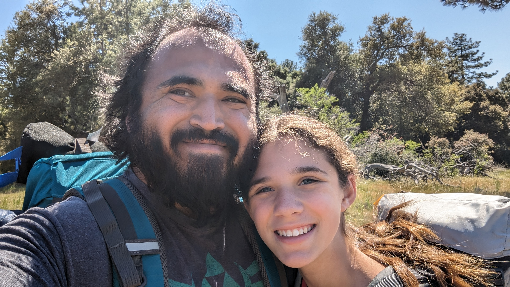
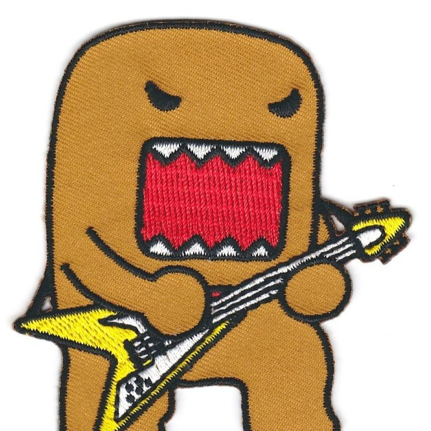

# About Me

<figure markdown="span">
  { loading=lazy }
  <figcaption>Me and my kiddo backpacking</figcaption>
</figure>

My name is Pablo Baxter, and I've been the owner of the frybits.com domain for the past 7 years. This website is mainly about the work I do or the hobbies I have, though I may occasionally blog on it as well.

I am an Android Engineer, though lately I've been dabbling in the wonderful world of Android Build Engineering and Developer Experience.

---

<figure markdown="span">
  { loading=lazy align=center width=100 }
  <figcaption>You may recognize me from my avatar used on my various socials.</figcaption>
</figure>

---

A little bit more about me, I grew up all over Southern California, but finally settled in San Diego, CA.

My career started in tech, where I worked as IT support, however life led me to join the United States Air Force. There, I maintained C-130E/H aircraft, serving in Southwest Asia.

After the military, I wanted to get my degree in Marine Biology, but life again led me to chase a Computer Science major after my first programming class. Since then, I've worked at a startup named [PathSense](https://pathsense.com/), which led to my next job at [Life360](https://www.life360.com/), before arriving at [Block](https://block.xyz/). I have since left Block and rejoined Life360, focusing on pet safety and introducing new features to the Life360 app.

I love software development, backpacking, camping and "glamping" in my travel trailer, geocaching, and tinkering with all sorts of stuff (electronics, my travel trailer, my truck, etc).
