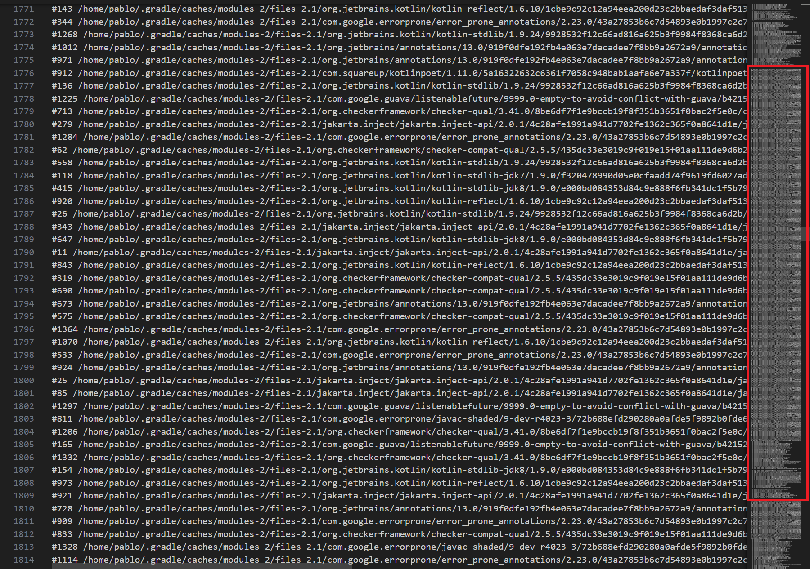

# Detecting File Leak in the Kotlin Daemon

File handle leaks are notoriously difficult to debug, so much so that most of the “fixes” for them are “increase the file descriptor limit”. However, this is not a fix. This is as close as you can get to covering your ears and closing your eyes, then screaming “I CAN’T HEAR YOU” to a bug. The file handle leak will still exist, but now it’s ignored.

<figure markdown="span">
  { loading=lazy }
  <figcaption>Seriously, it's exactly this</figcaption>
</figure>

In this case study, I decided to take the approach of finding out why the leak was occurring, and finding the best fix for it.

<!-- more -->

## Signs of a File Handle Leak

The hardest part of debugging an issue is noticing it to begin with and file handle leaks are very hard to notice until an error is thrown, and even then it may not be noticed since the error could be handled by some logic that changes the exception cause or swallows it altogether. So how did I notice the one in the Kotlin daemon? Dumb luck. I had been tracking another file handle leak in the Gradle daemon, and just got curious about how many files remained open in the Kotlin daemon after compilation.

There are some signs that your application may have a file handle leak, but even these signs are easily missed. A few common signs are:

* Errors relating to files unable to be created
* Any error about a file being deleted (especially on Windows)
* Unable to open files for any reason
* Files having garbage data written or being corrupted

These issues don't always appear on every run and could be intermittent as well. 

## Noticing the Kotlin Daemon File Handle Leak

Going back to how I found the Kotlin daemon file handle leak, as I had mentioned previously, I found it due to curiosity and dumb luck. When Paul Klauser ([https://github.com/PaulKlauser](https://github.com/PaulKlauser)) reported a [metaspace leak](https://youtrack.jetbrains.com/issue/KT-72169/Kotlin-Daemon-Metaspace-leak) occuring in the Kotlin daemon, I was curious if this metaspace leak was potentially due to a file handle leak, as I had been tracking one in the Gradle daemon (which I still haven't found).

To go over how I did this at a high-level (more details later on), I attached Jenkin's [file-leak-detector](https://github.com/jenkinsci/lib-file-leak-detector) to the Kotlin daemon and ran `./gradlew clean assembleDebug --rerun-tasks` several times, capturing the output of the file leak tool and using a post-processor (see [https://github.com/centic9/file-leak-postprocess](https://github.com/centic9/file-leak-postprocess)) to make the logs easier to read. I ended up with a file containing many stacktraces that show where the file was opened. Many of them looked like the following (shortened for easy reading):

``` text title="Actual file leak ouput" linenums="1"
// Several hundred other open files up here with the same stacktrace
...
#1295 /home/pablo/.gradle/caches/modules-2/files-2.1/org.jetbrains.kotlin/kotlin-stdlib-jdk8/1.9.0/e000bd084353d84c9e888f6fb341dc1f5b79d948/kotlin-stdlib-jdk8-1.9.0.jar by thread:RMI TCP Connection(10)-127.0.0.1 on Wed Oct 09 18:35:43 PDT 2024
#542 /home/pablo/.gradle/caches/modules-2/files-2.1/org.checkerframework/checker-qual/3.41.0/8be6df7f1e9bccb19f8f351b3651f0bac2f5e0c/checker-qual-3.41.0.jar by thread:RMI TCP Connection(21)-127.0.0.1 on Wed Oct 09 18:35:52 PDT 2024
#341 /home/pablo/.gradle/caches/modules-2/files-2.1/com.google.guava/listenablefuture/9999.0-empty-to-avoid-conflict-with-guava/b421526c5f297295adef1c886e5246c39d4ac629/listenablefuture-9999.0-empty-to-avoid-conflict-with-guava.jar by thread:RMI TCP Connection(140)-127.0.0.1 on Wed Oct 09 18:36:13 PDT 2024
	at java.base/java.util.zip.ZipFile.<init>(ZipFile.java:181)
	at java.base/java.util.jar.JarFile.<init>(JarFile.java:346)
	at java.base/jdk.internal.loader.URLClassPath$JarLoader.getJarFile(URLClassPath.java:825)
	at java.base/jdk.internal.loader.URLClassPath$JarLoader$1.run(URLClassPath.java:769)
	at java.base/jdk.internal.loader.URLClassPath$JarLoader$1.run(URLClassPath.java:762)
    ...
	at java.base/java.net.URLClassLoader$3.next(URLClassLoader.java:659)
	at java.base/java.net.URLClassLoader$3.hasMoreElements(URLClassLoader.java:684)
	at java.base/java.lang.CompoundEnumeration.next(ClassLoader.java:2730)
	at java.base/java.lang.CompoundEnumeration.hasMoreElements(ClassLoader.java:2739)
	at java.base/java.util.ServiceLoader$LazyClassPathLookupIterator.nextProviderClass(ServiceLoader.java:1210)
	at java.base/java.util.ServiceLoader$LazyClassPathLookupIterator.hasNextService(ServiceLoader.java:1228)
	at java.base/java.util.ServiceLoader$LazyClassPathLookupIterator.hasNext(ServiceLoader.java:1273)
	at java.base/java.util.ServiceLoader$2.hasNext(ServiceLoader.java:1309)
	at java.base/java.util.ServiceLoader$3.hasNext(ServiceLoader.java:1393)
	at com.google.common.collect.ImmutableSet.copyOf(ImmutableSet.java:280)
	at com.google.common.collect.ImmutableSet.copyOf(ImmutableSet.java:265)
	at dagger.internal.codegen.ServiceLoaders.loadServices(ServiceLoaders.java:35)
	at dagger.internal.codegen.DelegateComponentProcessor.lambda$initialize$0(DelegateComponentProcessor.java:89)
    ...
	at dagger.internal.codegen.DelegateComponentProcessor.initialize(DelegateComponentProcessor.java:89)
	at dagger.internal.codegen.KspComponentProcessor.initialize(KspComponentProcessor.java:49)
	at dagger.spi.internal.shaded.androidx.room.compiler.processing.ksp.KspBasicAnnotationProcessor.process(KspBasicAnnotationProcessor.kt:57)
	at com.google.devtools.ksp.AbstractKotlinSymbolProcessingExtension$doAnalysis$8$1.invoke(KotlinSymbolProcessingExtension.kt:310)
	at com.google.devtools.ksp.AbstractKotlinSymbolProcessingExtension$doAnalysis$8$1.invoke(KotlinSymbolProcessingExtension.kt:308)
	at com.google.devtools.ksp.AbstractKotlinSymbolProcessingExtension.handleException(KotlinSymbolProcessingExtension.kt:414)
	at com.google.devtools.ksp.AbstractKotlinSymbolProcessingExtension.doAnalysis(KotlinSymbolProcessingExtension.kt:308)
	at org.jetbrains.kotlin.cli.jvm.compiler.TopDownAnalyzerFacadeForJVM.analyzeFilesWithJavaIntegration(TopDownAnalyzerFacadeForJVM.kt:112)
	at org.jetbrains.kotlin.cli.jvm.compiler.TopDownAnalyzerFacadeForJVM.analyzeFilesWithJavaIntegration$default(TopDownAnalyzerFacadeForJVM.kt:75)
    ...
```

> So what's going on here and how does this tell the story of a file leak?

Well, this stacktrace actually represents 417 files that were opened and never closed when the Gradle task was completed, but for brevity, I only listed the final three files left open (lines 3-5). All these files were opened at the `ZipFile` constructor (line 6), however that is not where the origin of the file was at. It actually originated elsewhere in this stacktrace, which required some investigation. Also, this is just one stacktrace for the given set of files. There were 1380 files left open at the end of the Gradle task run, and about another 1k extra files were opened after each run. In the following sections, I'll get into the details of how I debugged this file leak and found the fix for it.

## Setting Up the file-leak-detector

To begin with, I downloaded the [file-leak-detector](https://github.com/jenkinsci/lib-file-leak-detector) jar, and in the root `gradle.properties` file of the [NowInAndroid](https://github.com/android/nowinandroid) repo, I appended the following line to the JVM args of the Kotlin daemon:

```properties title="gradle.properties"
kotlin.daemon.jvmargs=<other args> -javaagent:/path/to/file-leak-detector-jar-with-dependencies.jar=http=19999
```

What this does is attach the file-leak-detector Java Agent to each Kotlin daemon that is launched. Since I only want one Kotlin daemon running, I made sure to kill the other Kotlin daemon processes before running the Gradle command.

The flag `http=19999` creates a local web server on port `19999` that the file-leak-detector uses to provide a list of all the open files and stacktraces to them. This is important as the Kotlin daemon is a long lived process, so it doesn't exit when the build has completed.

## Capturing the File Handle Leak

Getting this file handle leak to occur was a bit tricky. I had to determine the task that would trigger the Kotlin compiler, and ensure that consecutive executions were re-run properly. For this reason I chose to run `./gradlew clean assembleDebug --rerun-tasks` in order to ensure that the compilation occurred each time.

So what does each part do?

  * `clean` ensures that no generated code exists, and gives me a clean build directory.
  * `assembleDebug` triggers the compilation of the Android app in NowInAndroid.
  * `--rerun-tasks` tells the Gradle daemon to ignore any up-to-date checks from tasks and rerun them all.

After the first successful build of NowInAndroid using the above command, I was able to go to `localhost:19999`, which output all the open files left on the Kotlin daemon. That's where I got my first indication that something may be wrong, as I was left with 1380 file handles left open. This didn't necessarily mean there was a file leak, as these open file handles could be cached. To be sure, I stored this result as a text file, and re-ran the Gradle command while making sure the Kotlin daemon was not restarted or killed.

The next run left me with 2694 open file handles, with each run opening another ~1k files. This was obviously a leak. I stored the results of each run in a text file for post-processing, to make it easier to read.

## Analyzing the Results

The [file-leak-postprocess](https://github.com/centic9/file-leak-postprocess) tool is useful as it gets all the open file handles that share a similar stacktrace and groups them together (see output above). I ran this post-processor tool for each output I collected, and took a quick look to see where most of these files were being opened. Visual Studio Code does a great job visualizing which stacktraces have the most open file handles.

<figure markdown="span">
  { loading=lazy }
  <figcaption>That's a lot of open files!</figcaption>
</figure>

With this, I saw that there was a cluster of open files that shared common stacktraces. What I needed to identify was which of these grew on consecutive runs, as that would determine the location of the leaks. Again, Visual Studio Code came handy with their "Compare Selected" option when 2 files are selected in the file navigation. However, this comparison was a bit confusing to me at first.

<figure markdown="span">
  { loading=lazy }
  <figcaption>Comparing the base to another run</figcaption>
</figure>

Typically, I would only see new files added to specific stacktraces that pointed out the leaks, yet here we had the previous files being closed and an increasing number of new files being opened. At first, I believed this to be due to a collection that was growing after each run, however I was not able to find any evidence to support this theory. The next approach I took was looking at the stacktraces and understanding a common root for them all. Thankfully, I had [Jason Pearson](https://www.jasonpearson.dev/) in a Slack thread helping me out identify this common root, which he pointed out to be `org.jetbrains.kotlin.cli.jvm.K2JVMCompiler.doExecute(K2JVMCompiler.kt:43)`.

Now that I knew the general area of where the file leaks were occurring, I was able to dig a bit deeper to understand the root cause, and discovered that both the [Kotlin source code](https://github.com/JetBrains/kotlin/blob/6af99c83470813023dace7d3bd850c6fef8e50c0/compiler/cli/src/org/jetbrains/kotlin/cli/jvm/plugins/PluginCliParser.kt#L161-L163) and [KSP source code](https://github.com/google/ksp/blob/1ca8ca1793afdea491d9afebd12a27388c500874/compiler-plugin/src/main/kotlin/com/google/devtools/ksp/KotlinSymbolProcessingExtension.kt#L86-L95) were creating `URLClassloader` objects, but never closing them. By default, `URLClassloader` caches the underlying `.jar` files being opened, and keeps them open until the `URLClassloader` has closed or has been garbage collected (see: [Closing a URLClassLoader](https://docs.oracle.com/javase/7/docs/technotes/guides/net/ClassLoader.html)). With this finding, I filed a bug with the [Kotlin team](https://youtrack.jetbrains.com/issue/KT-72172/File-Leak-occurring-in-Kotlin-Daemon) and with the [Google/KSP team](https://github.com/google/ksp/issues/2159).

## Patching the File Handle Leaks

The fix for these file leaks was rather easy for KSP. I just needed to call `URLClassloader.close()`. This was quickly achieved in [this PR](https://github.com/google/ksp/pull/2164). Testing was a bit more difficult, but after working with the KSP team, I was able to test a local build of it on NowInAndroid and verified the file leaks for KSP were gone!

As for the Kotlin project fix, I made an attempt at a [fix](https://github.com/JetBrains/kotlin/pull/5372), but it turned that it would require quite a bit [more effort](https://github.com/JetBrains/kotlin/commit/8c6390b1e9ba16c1bf05df34205584f80530f34e). Essentially, there were many paths to open a `URLClassloader`, and my PR didn't cover all of those. Thankfully, [Brian Norman](https://github.com/bnorm) on the Kotlin team took the charge on this fix!